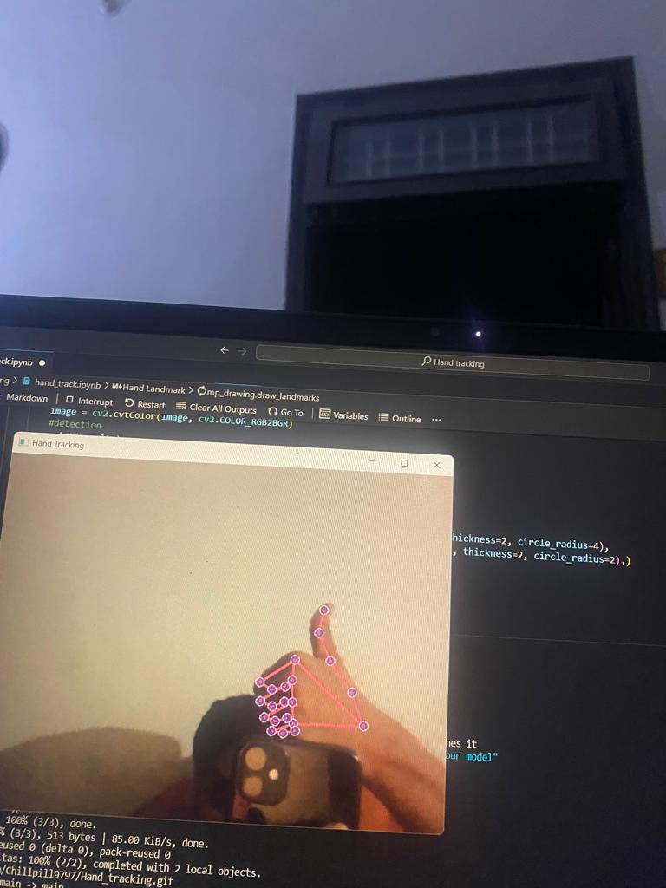

🖐️ Welcome to HandTrackCV! 🖥️

HandTrackCV is an innovative project utilizing Computer Vision to track and analyze hand movements in real-time. Whether you're a developer exploring the possibilities of gesture recognition or an enthusiast curious about the capabilities of modern technology, HandTrackCV offers a fascinating glimpse into the world of computer vision.

## Key Features

🔍 **Real-Time Tracking**: Seamlessly tracks the movements of hands in live video streams, providing instant feedback and insights.

🤚 **Gesture Recognition**: Detects and interprets a variety of hand gestures, enabling interactive applications and user interfaces.

📊 **Data Visualization**: Visualizes hand tracking data in intuitive graphs and charts, allowing for deeper analysis and insights into movement patterns.

🔧 **Customization Options**: Offers flexible configuration settings to adjust tracking parameters and optimize performance for different environments and use cases.

🚀 **Easy Integration**: Simple to integrate into existing projects and applications, with support for popular programming languages and frameworks.

## Applications

🎮 **Gaming**: Enhance gaming experiences with intuitive gesture controls and immersive interactions.

✋ **User Interfaces**: Create touchless interfaces for interactive displays, kiosks, and augmented reality applications.

👋 **Healthcare**: Develop rehabilitation tools and assistive technologies for individuals with mobility impairments.

🔍 **Security**: Implement gesture-based authentication systems for enhanced security and access control.

## Get Started

Ready to dive into the exciting world of hand tracking? Follow these steps to get started with HandTrackCV:

1. **Clone the Repository**: 

    ```bash
    git clone https://github.com/your-username/handtrackcv.git
    ```

2. **Install Dependencies**: 

    ```bash
    pip install -r requirements.txt
    ```

3. **Run the Demo**: 

    ```bash
    python handtrack_demo.py
    ```

4. **Explore and Experiment**: Experiment with different gestures, explore the codebase, and unleash your creativity!

## Get in Touch

Got questions, ideas, or feedback? Feel free to reach out! Connect with me on LinkedIn or GitHub to collaborate on exciting projects or discuss the latest advancements in computer vision and gesture recognition.

Let's shape the future together, one hand gesture at a time! 🚀🤚

---
👉 Connect with me on [LinkedIn](https://www.linkedin.com/in/aditya-goswami-456511227/) for more updates and projects! 👈


## the output of this code look as follows:

